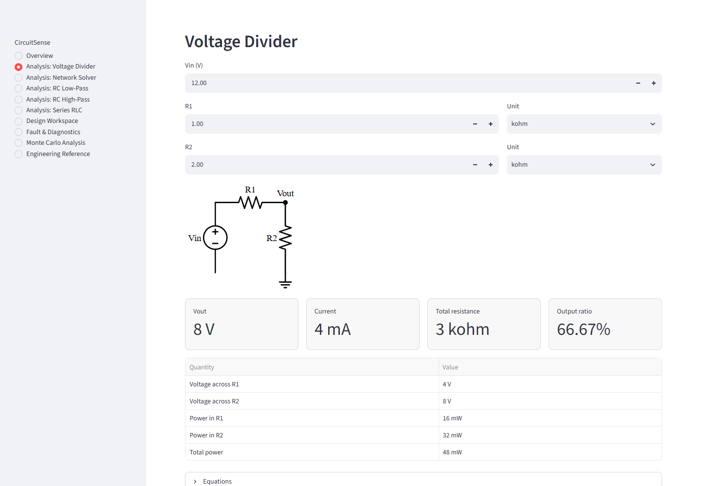
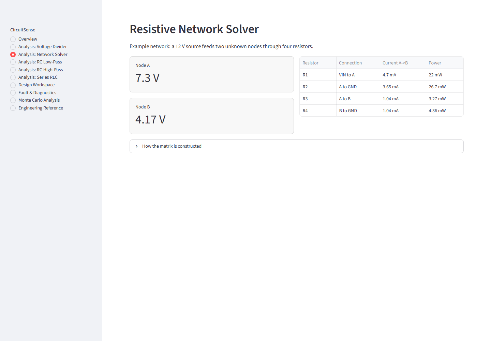
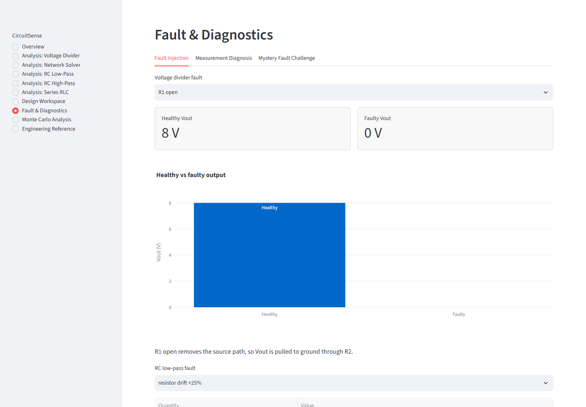
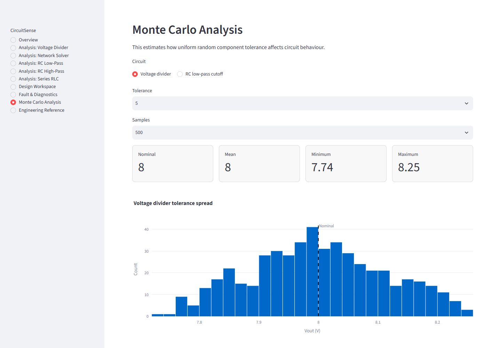

# CircuitSense

**Interactive Circuit Analysis, Design & Fault Diagnosis**

CircuitSense is a Python engineering application for analysing fundamental electrical circuits, solving resistive networks using nodal analysis, designing component values, modelling RC/RLC frequency response and diagnosing simulated component faults.

It is designed as a polished portfolio project for an early-stage computer engineering student: technically credible, testable and explainable without pretending to be a professional SPICE simulator.

## Key Features

- Voltage-divider analysis with voltage, current and power calculations
- Automated nodal analysis for small resistive networks
- Multi-node resistor solving with NumPy matrix equations
- RC low-pass and high-pass filter modelling
- RLC resonance analysis with impedance, current, phase, quality factor and bandwidth
- Interactive Bode plots and step-response plots
- Design tools for voltage dividers, RC filters and RLC resonance
- Fault injection for voltage dividers and RC low-pass filters
- Rule-based measurement diagnosis with qualitative confidence labels
- Simulated measurement-noise context and mystery fault challenge
- Monte Carlo tolerance analysis
- Engineering-unit formatting
- Automated pytest coverage
- GitHub Actions continuous integration

## Screenshots

### Voltage Divider



### Network Solver



### Fault Diagnostics



### Monte Carlo Analysis



To regenerate screenshots from a running app:

```bash
npm run screenshots
```

## Example: Voltage Divider

For:

- Vin = 12 V
- R1 = 1 kohm
- R2 = 2 kohm

CircuitSense calculates:

- Current = 4 mA
- Vout = 8 V
- Output ratio = 66.67%

## Example: Nodal Analysis

The default network uses:

- VIN = 12 V
- R1 from VIN to Node A
- R2 from Node A to ground
- R3 from Node A to Node B
- R4 from Node B to ground

CircuitSense builds a conductance matrix, solves `Ax = b` using `numpy.linalg.solve()`, then calculates node voltages, branch currents and resistor power.

## Example: RC Design

For a target cutoff of 500 Hz with a 100 nF capacitor:

- Theoretical resistance: about 3.18 kohm
- Nearest E12 standard resistor: 3.3 kohm
- Actual cutoff: about 482 Hz

## Engineering Concepts

CircuitSense demonstrates:

- Ohm's law
- Kirchhoff's current law
- Kirchhoff's voltage law
- Conductance
- Nodal analysis
- Linear algebra
- RC filters
- RLC resonance
- Frequency response
- Component tolerance
- Fault analysis

## Architecture

The project separates the Streamlit interface from the engineering calculations:

- `app.py` contains the interactive user interface.
- `circuitsense/voltage_divider.py` handles voltage-divider maths.
- `circuitsense/nodal.py` builds and solves nodal-analysis matrix equations.
- `circuitsense/filters.py` models RC filters.
- `circuitsense/rlc.py` models series RLC resonance.
- `circuitsense/design.py` solves reverse component-selection problems.
- `circuitsense/faults.py` contains simplified fault models.
- `circuitsense/diagnosis.py` contains rule-based fault diagnosis.
- `circuitsense/monte_carlo.py` simulates tolerance variation.
- `circuitsense/plotting.py` builds Plotly charts.
- `circuitsense/schematics.py` renders simple Schemdraw schematics where available.
- `circuitsense/reports.py` exports Markdown reports.

## Installation

```bash
python -m venv .venv
.venv\Scripts\activate
pip install -r requirements.txt
```

On macOS or Linux:

```bash
python3 -m venv .venv
source .venv/bin/activate
pip install -r requirements.txt
```

## Running

```bash
streamlit run app.py
```

## Tests

```bash
pytest
```

## Limitations

- Idealised components only
- Simplified fault models
- No transistor modelling
- No parasitic resistance, capacitance or inductance
- No physical hardware measurements
- No safety-critical design validation
- Not a replacement for SPICE or professional electrical engineering review

## Future Work

- Add op-amp circuit modules
- Expand RLC network analysis
- Import sensor or multimeter readings
- Add microcontroller measurement examples
- Add a SPICE backend for comparison
- Explore hardware-in-the-loop experiments
